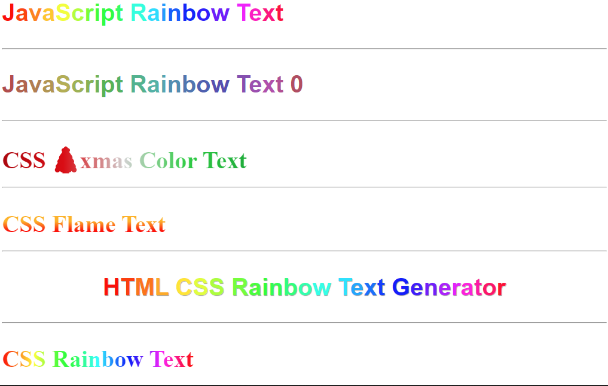

# Rainbow-Text-Multi-Color-Text
Rainbow Text Multi Color Text



```html
<style>
.rainbow-text {
	font-family: Arial;
	font-weight: bold;
	font-size: 50px;
	text-shadow: #A3A3A3 1px 1px 1px;
}
.rainbow-text .block-line > span {
	display: inline-block;
}
  .css-rainbow-text {
    background: linear-gradient(90deg, #f00, #ff2b00, #f50, #ff8000, #fa0, #ffd500, #ff0, #d4ff00, #af0, #80ff00, #5f0, #2bff00, #0f0, #00ff2b, #0f5, #00ff80, #0fa, #00ffd5, #0ff, #00d4ff, #0af, #007fff, #05f, #002bff, #00f, #2a00ff, #50f, #7f00ff, #a0f, #d400ff, #f0f, #ff00d4, #f0a, #ff0080, #f05, #ff002b, #f00);
    color: #0000;
    -webkit-background-clip: text;
    background-clip: text;
    font-size: 50px;
    font-weight: bold;
    display: inline-block;
}
.css-flame-text {
    background-image: linear-gradient(0deg, #f00 25%, #ffb300 60%);
    color: #0000;
    -webkit-background-clip: text;
    background-clip: text;
    font-size: 50px;
    font-weight: bold;
    display: inline-block;
}
  .css-christmas-color {
    background: linear-gradient(90deg, #ad000c, #dd0010, #d1d1d1, #1ece35, #00ad2b);
    color: #0000;
    -webkit-background-clip: text;
    background-clip: text;
    font-size: 50px;
    font-weight: bold;
    display: inline-block;
    
}
#js-rainbow-1, #js-rainbow-2 {
    font-family: Arial;
    font-weight: bold;
    font-size: 50px;
}


</style>
<div id="js-rainbow-1">JavaScript Rainbow Text </div>

<br>
<br>
<hr>
<br>
<br>

<div id="js-rainbow-2">JavaScript Rainbow Text 0</div>

<br>
<br>
<hr>
<br>
<br>

<div class="css-christmas-color">CSS 🎄xmas Color Text</div>
<br>
<br>
<hr>
<br>
<br>

<div class="css-flame-text">CSS Flame Text</div>

<br>
<br>
<hr>
<br>
<br>

<div class="rainbow-text" style="text-align: center;">
	<span class="block-line"><span><span style="color:#ff0000;">H</span><span style="color:#ff3c00;">T</span><span style="color:#ff7300;">M</span><span style="color:#ffaa00;">L&nbsp;</span></span><span><span style="color:#ffe500;">C</span><span style="color:#e1ff00;">S</span><span style="color:#aaff00;">S&nbsp;</span></span><span><span style="color:#6eff00;">R</span><span style="color:#37ff00;">a</span><span style="color:#00ff00;">i</span><span style="color:#00ff3c;">n</span><span style="color:#00ff73;">b</span><span style="color:#00ffaa;">o</span><span style="color:#00ffe6;">w&nbsp;</span></span><span><span style="color:#00e1ff;">T</span><span style="color:#00a6ff;">e</span><span style="color:#006eff;">x</span><span style="color:#0037ff;">t&nbsp;</span></span><span><span style="color:#0400ff;">G</span><span style="color:#3c00ff;">e</span><span style="color:#7300ff;">n</span><span style="color:#ae00ff;">e</span><span style="color:#e500ff;">r</span><span style="color:#ff00e1;">a</span><span style="color:#ff00aa;">t</span><span style="color:#ff006e;">o</span><span style="color:#ff0037;">r</span></span></span>
</div>
<br>
<br>
<hr>
<br>
<br>

<div class="css-rainbow-text">CSS Rainbow Text</div>
<script>
class RainbowText {
    constructor(element, saturation = 100, lightness = 50) {
        // script - https://www.html-code-generator.com/html/rainbow-text-generator
        // saturation = (int) between 20 - 100;
        // lightness =  (int) between 20 - 99;
        if (!element) {
            return;
        }
        this.saturation = saturation < 20 ? 20 : saturation > 100 ? 100 : saturation;
        this.lightness = lightness < 20 ? 20 : lightness > 99 ? 99 : lightness;
        if (element.length !== void 0 && element.length >= 1) {
            for (let i = 0; i < element.length; i++) {
                this.do_color(element[i]);
            }
        } else {
            this.do_color(element);
        }
    }
    do_color(element) {
        let text = element.innerText;
        let text_length = text.length;
        if (text_length < 2) {
            return;
        }
        let span = '';
        for (let i = 0; i < text_length; i++) {
            span += '<span style="color:hsl(' + Math.round((360 * i / text_length)) + ',' + this.saturation + '%, ' + this.lightness + '%)">' + text[i] + '</span>';
        }
        element.innerHTML = span;
    }
};


// default
new RainbowText(document.getElementById("js-rainbow-1"));

// set color brightness
// saturation = 40;
// lightness = 50;
new RainbowText(document.getElementById("js-rainbow-2"), 40, 50);
</script>
```
